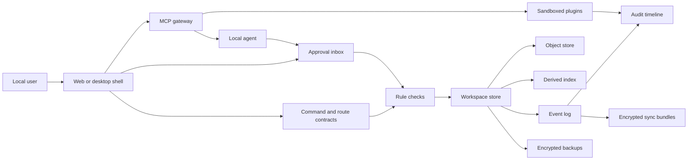
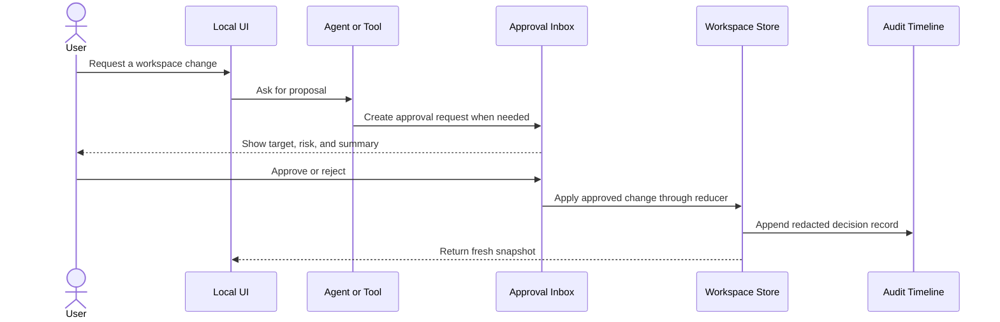
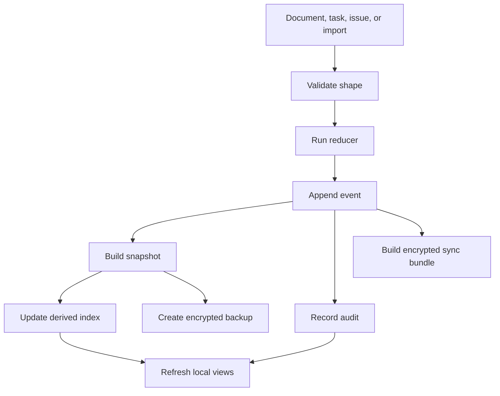
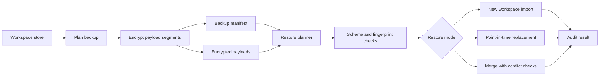
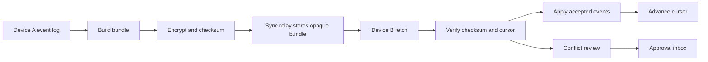
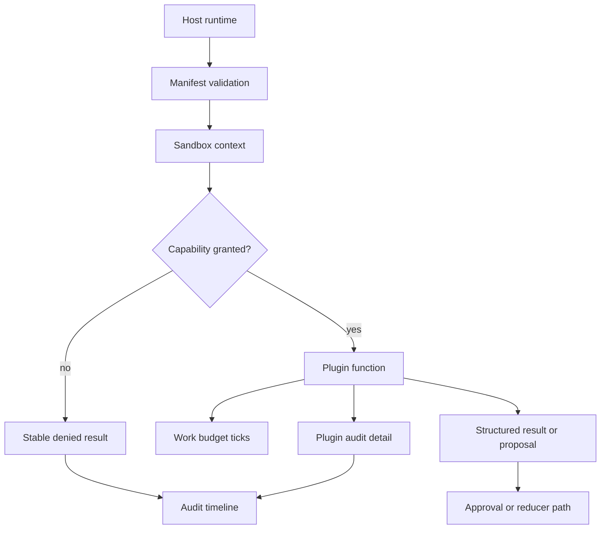

# Architecture Diagrams

These diagrams summarize the local-first architecture for private workspaces.
They are intentionally implementation-facing and mirror the package boundaries
described in the other docs.

## Component View

The UI and desktop shell do not own durable business logic. They adapt user
intent into typed route or command contracts. Rule checks, reducers, audit
emitters, backup planning, and sync bundling stay behind narrow interfaces.

## Local-First Write Path

Agents and tools should stop after creating an approval request. The durable
write happens only after approval and validation by the host.

## Workspace Data Flow

The event log is the durable source of truth. Search indexes, dashboards, and
summary views are derived and can be rebuilt from events and checkpoints.

## Backup And Restore

The restore planner runs before import. Replacement and merge modes require
explicit approval because they can overwrite or combine durable state.

## Sync Relay

The relay stores encrypted bundles and routing metadata. Devices validate
workspace ids, cursors, checksums, and conflicts before accepting events.

## Plugin Boundary

Plugins receive a narrow context and return structured results. The host owns
durable writes, approval routing, and audit persistence.
